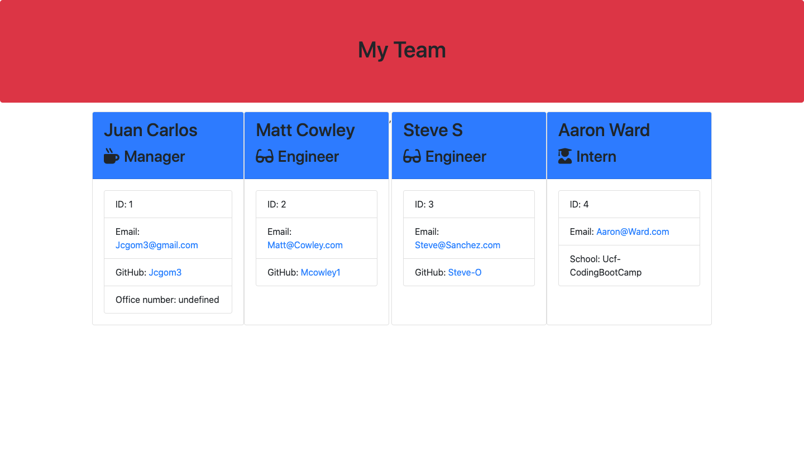

# Challenge-10-MyTeamGenerator

# Summary
Create a team profile generator using Javascript, OOP, Node.js, inquirer & jest.

# Mockup Image

# Description
This app allows users to input employee info for their team including: Manager, Engineer, and Intern
# Table of Contents 
* [Installation](#installation)
* [Usage](#usage)
* [License](#license)
* [Contributing](#contributing)
* [Tests](#tests)
* [Questions](#questions)
# Installation
The following necessary dependencies must be installed to run the application properly: inquirer, path, fs, jest
# Usage
In order to use this app, install the dependencies and run the app in the terminal on VS Code. Click on the video for a demonstration. 
# Demo
* [Demo-Video](https://drive.google.com/file/d/18x84c2byFxjVtmEdKk2d_NscABWTit71/view)
# License

# Contributing
​Contributors: N/A
# Tests
The following are needed to conduct tests: Node.js & Jest
# Questions
## Please contact me:
  * [My GitHub Profile](https://github.com/jcgom3)
  * [My Github Project Repository]( https://jcgom3.github.io/Challenge-10-MyTeamGenerator/)
  * Email me at: [Jcgom3@gmail.com](mailto:Jcgom3@gmail.com) with questions or make an issue about this project.
